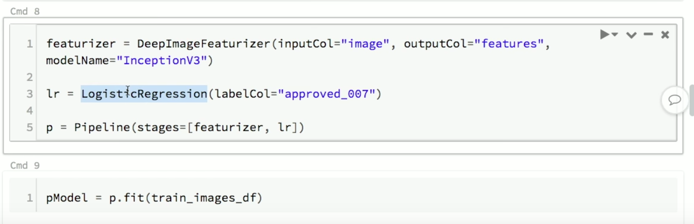
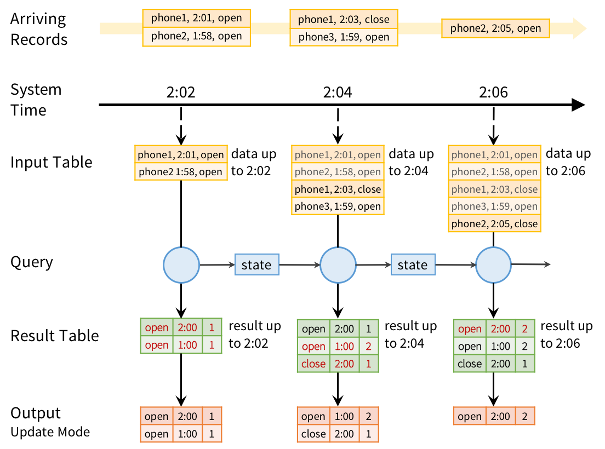
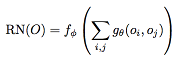
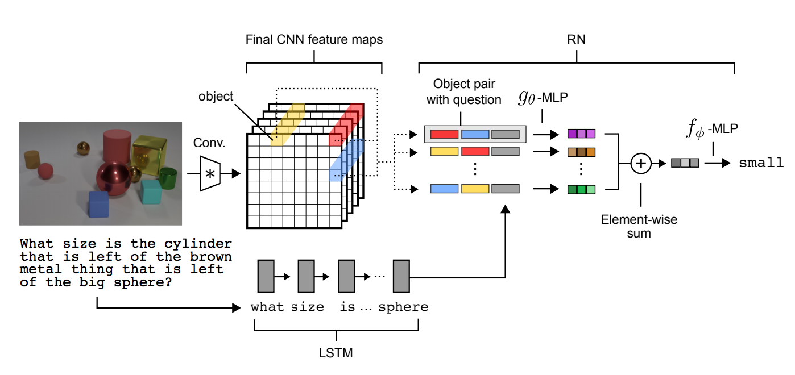
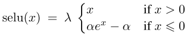
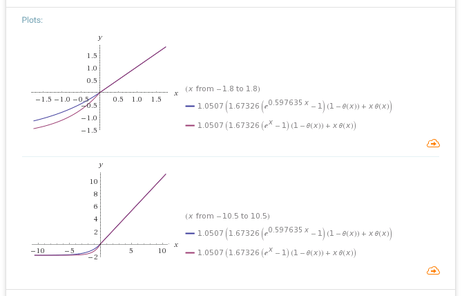
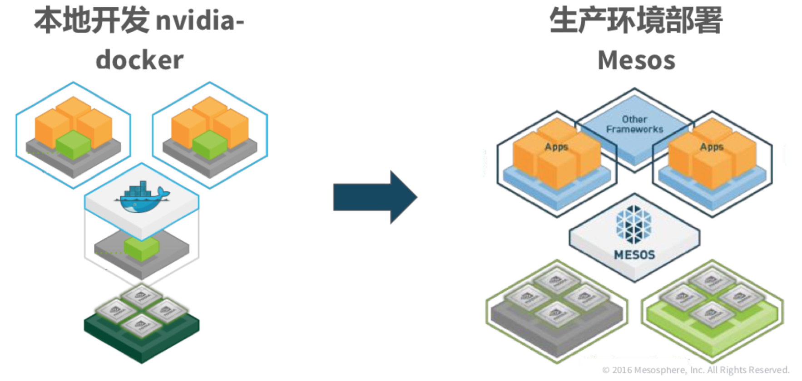

### 技术调研 @7.14
Mainly from: [Spark Summit](https://spark-summit.org/2017/schedule/),
[QCon](qconnewyork.com/schedule/ny2017/tabular), 
[DeepMind](https://deepmind.com)

----------

[link to below 2](https://spark-summit.org/2017/events/expanding-apache-spark-use-cases-in-22-and-beyond/)

* Expanding Apache Spark Use Cases in 2.2 and Beyond
  * Current APIs(TensorFlow, Keras, BigDL) are low-level
      * build a computation graph from scratch
      * Scale-out typically requires manual parallelization
  * New library: Deep Learning Pipelines [video](https://youtu.be/qAZ5XUz32yM?t=19m56s)

* Structured Streaming:

  * Continuous Processing (issue SPARK-20928) [video](https://youtu.be/qAZ5XUz32yM?t=37m5s):
      * Streaming execution *without microbatches*
      * Supports asynchronous checkpointing
      * This limitation is a result of the fact that getBatch requires us to know both the starting and the ending offset, before any tasks are launched. In the worst case, the end-to-end latency is actually closer to the average batch time + task launching time.

```scala
trait Epoch {
    def data: DataFrame

    /** The exclusive starting position for `data`. */
    def startOffset: Offset

    /** The inclusive ending position for `data`.  Incrementally updated during processing, but not complete until execution of the query plan in `data` is finished. */
    def endOffset: Offset
  }

  def getBatch(startOffset: Option[Offset], endOffset: Option[Offset], limits: Limits): Epoch

```

* [Managing Data in Microservices](https://www.infoq.com/news/2017/06/managing-data-in-microservices) ([中文翻译](http://www.infoq.com/cn/news/2017/07/managing-data-in-microservices?utm_source=infoq&utm_medium=popular_widget&utm_campaign=popular_content_list&utm_content=homepage))
  * Shared Data: Single System of Record (SoR), a synchronous lookup (one service calls the other service for data), asynchronous event with a cache, or a shared metadata library.
  * Joins: creating "Materialized Views" by listening to events from two services and maintaining a denormalized join of the two data sets in local storage.
  * Transactions: Hard, since data is split across different services. Implement transactions as workflows with a rollback mechanism by applying the compensating operations in reverse order.

* [GraphQL vs REST: Things to Consider] (https://www.infoq.com/news/2017/07/graphql-vs-rest?utm_source=infoq&utm_medium=popular_widget&utm_campaign=popular_content_list&utm_content=homepage)
  * GraphQL
      * reduces network hops, all in single query (advantage from single endpoint)
      * WYSIWYG model
      * provides a schema for consumers
  * REST: 
      * consistency and predictability by making use of status codes and HTTP verbs (a consumer sends a DELETE request to a resource, they know the operation is safe and idempotent,)
      * allowing them to "discover" resource relations
      * implements caching
  * To conclude, Lauret believes there is no silver bullet, and it’s just a matter of choosing whatever makes the most sense for the current requirements.

* [A neural approach to relational reasoning](https://deepmind.com/blog/neural-approach-relational-reasoning/)
  * 
  * `f,g` are multiple layer NN. `f` for intensity, `g` for relation.
  * The functional form in Equation 1 dictates that an RN should consider the potential relations between *all* object pairs
  * In graph theory parlance, the input can be thought of as a complete and directed graph whose
nodes are objects and whose edges denote the object pairs whose relations should be considered.
  * 
  * LSTM: Long Short Term Memory: [explaination](http://colah.github.io/posts/2015-08-Understanding-LSTMs/)
  * Problem: what is learned?

* [Self-Normalizing Neural Networks] (https://arxiv.org/abs/1706.02515)
  * 抛开内容，是篇奇文...102页，70+页电脑辅助证明...奥地利出品。reviewer...
  * 

  ```python
    def selu(x):
    	alpha = 1.6732632423543772848170429916717
    	lambdaa = 1.0507009873554804934193349852946
    	return lambdaa*np.where(x>=0.0, x, alpha*np.exp(x)-alpha)
    ```
  * SELU: (E,Var) is stable and attracting fixed point from layer to layer. **normalization is
transitive across layers.**
  * **Negative Values & slope>1 when positive!**: avoid gradient vanishing while regularizing gradients when too large.
    

* [Mesos，数据中心操作系统的核心](http://www.infoq.com/cn/presentations/mesos-the-heart-of-the-data-center-operating-system?utm_source=presentations_about_architecture-design&utm_medium=link&utm_campaign=architecture-design#downloadPdf)
  * CNI(Container Network Interface) [github](https://github.com/containernetworking/cni):
      * 介于容器管理器和网络插件之间的 一个简单的基于JSON的协议
          * 通过命令行的方式调用插件
          * ADD:加入网络
          * DEL:退出网络
  * CSI(Container Storage Interface) [preview](https://docs.google.com/document/d/1JMNVNP-ZHz8cGlnqckOnpJmHF-DNY7IYP-Di7iuVhQI/edit#)
      * Docker卷插件存在不少设计缺陷
          * 不支持块设备访问
          * 不支持远程分离(detach)
          * Mount/Unmount不是idempotent(幂等)的
      * Architecture & Volume Lifecycle in [link](https://docs.google.com/document/d/1JMNVNP-ZHz8cGlnqckOnpJmHF-DNY7IYP-Di7iuVhQI/edit#) 
  * New Features:
      * Nvidia GPU支持
          * 支持docker容器的nvidia标签
          * 挂载nvidia基础库到容器内的/usr/local/nvidia
          * 自动发现宿主机上的GPU，并且注入到容器之中
          * 容器之间GPU设备的隔离(not in NVIDIA-docker) [p18](http://events.linuxfoundation.org/sites/events/files/slides/mesoscon_asia_gpu_v1.pdf)
      * 

* [AUTO SCALING SYSTEMS WITH ELASTIC SPARK STREAMING](https://spark-summit.org/east-2017/events/auto-scaling-systems-with-elastic-spark-streaming/)
  * Streaming jobs on Mesos cluster and launched via Marathon.
  * collect `processing % = totalProcessingTime / microbatchInterval`
  * Don’t act on a single datapoint. Collect a sliding window and act on trend
  * Each streaming job: Expands/contracts independently from one another - it has no knowledge of its neighbor.
  * Impl random scaling - WTF why?!?! Before using any heuristics to trigger elasticity, we want to prove that no matter how good/bad your heuristics are, elasticity can only affect performance. Even with the worst heuristics, we want to prove that no data loss or corruption occurs. Random scaling intentionally forces the streaming job into a state of thrashing/flapping. We can observe the performance is much worse than no scaling at all.

* [Why the JVM is a Good Choice for Serverless Computing](https://www.infoq.com/news/2017/06/fearless-aws-lambda)
  * Both the beauty (and the challenge) of a platform like Lambda is you give up control.
  * Cold Starts
      * JVM, and application have to initialise due to an existing function instance not being ready to serve an event trigger
      * Cause: class loading, constructor and static block initialisation, alternative language runtime loading (e.g. Clojure), and JIT compilation.
      * Solution: ruthlessly removing unneeded dependencies should be applied.

--------
闲杂：

* [理解monad](http://hongjiang.info/understand-monad-0/)
  * "一个单子（Monad）说白了不过就是自函子范畴(sub-function)上的一个幺半群(Monoid)"
  * Group:
      * Multiplication
      * Closed under mult & inv: 对于任意a，b∈G，有a*b∈G, 对于任意a∈G，存在逆元a^-1∈G
      * Identity: a*e=a
      * Associativity: (a\*b)\*c=a\*(b\*c)
  * Semigroup:
      * Multiplication, Associativity
      * Closed under Multi.
      
	```scala
	object IntSemiGroup extends SemiGroup[Int] {
	    def append(a: Int, b: Int) = a + b
	}
	
	// 对2个元素结合
	val r = IntSemiGroup.append(1, 2)
	```
  * Monoid:
      * Multiplication, Associativity, Identity
      * Closed under Multi.

  ```
  object StringMonoid extends Monoid[String] {
        //Multiplication
        def append(a: String, b: String) = a + b
        //Identity
        def zero = ""
  }
  ```
  * 应用：`List("A","B","C").foldLeft("")(_+_)`
  * `List("A","B","C").foldLeft(StringMonoid.zero)(StringMonoid.append)`
  * 简单？别忘了Associativity. -->parallel, RDD
  
* [SpaceVim](http://spacevim.org/)
  * 界面很酷炫，约等于IDE，*AutoComplete*
  * 模块化配置集合
  * 按序延迟加载，目前 90% 的插件都是滞后加载